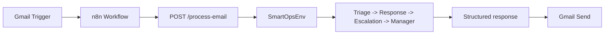

# SmartOps OpenEnv

SmartOps OpenEnv is a production-ready multi-agent customer support environment with:

- Stable FastAPI contract for n8n automation
- Deterministic agent behavior (no external API required)
- OpenEnv-compatible environment core (`reset`, `step`, `state`)
- Weighted reward grading + RL-ready wrapper

## Architecture



## API Contract (n8n-safe)

This contract is intentionally kept stable.

### Endpoint

`POST /process-email`

### Request

```json
{
  "subject": "Refund needed",
  "body": "I was charged twice for my order.",
  "customer_tier": "user"
}
```

### Response

```json
{
  "category": "billing",
  "urgency": 2,
  "response": "We are processing your refund and will confirm once the adjustment is complete.",
  "escalated": false,
  "priority": 2,
  "score": 1.0
}
```

## OpenEnv Specification

- **Environment**: `env/smart_ops_env.py`
  - `reset(task: dict | None, custom_email: dict | None, seed: int | None) -> Observation`
  - `step(action: Action) -> (Observation, Reward, done, info)`
  - `state() -> Observation`
- **Models**: `env/models.py` (`Observation`, `Action`, `Reward`)
- **Grader**: `env/graders.py` (`grade(task, memory, step_count) -> Reward`)
- **Tasks**: `tasks/definitions.py`
- **OpenEnv config**: `openenv.yaml`

### Reward Weights

- category match: `0.4`
- response keyword match: `0.3`
- escalation correctness: `0.2`
- priority correctness: `0.1`
- inefficiency penalty for extra steps

## Built-in Tasks

- `refund_request` (easy)
- `login_issue` (medium)
- `system_outage` (hard)

Each task defines:
- email input
- expected outputs
- evaluation rules

## Project Structure

```text
agents/
  triage.py
  response.py
  escalation.py
api/
  main.py
env/
  smart_ops_env.py
  models.py
  graders.py
  gym_wrapper.py
tasks/
  definitions.py
scripts/
  run_baseline.py
  run_multiagent.py
  train_rl.py
  eval_rl.py
main.py
app.py
openenv.yaml
```

## Quick Start

### 1) Install dependencies

```bash
pip install -r requirements.txt
```

### 2) Run FastAPI

```bash
python -m uvicorn main:app --host 0.0.0.0 --port 8000
```

Windows note: use `python -m uvicorn` (not plain `uvicorn`) if `uvicorn` is not in PATH.

Browser note: open `http://127.0.0.1:8000/` or `http://localhost:8000/` (not `0.0.0.0`).

### 3) Optional UI (Streamlit)

```bash
streamlit run app.py
```

### 4) Run baseline benchmark

```bash
python scripts/run_baseline.py
```

## RL (Optional)

```bash
pip install -r requirements-rl.txt
python scripts/train_rl.py
python scripts/eval_rl.py
```

## Docker

```bash
docker build -t smartops-openenv .
docker run -p 8000:8000 smartops-openenv
```

## Hugging Face Spaces

- Works with Docker Spaces using this repo.
- Suggested start command (non-Docker): `python -m uvicorn main:app --host 0.0.0.0 --port 7860`
- `requirements.txt` is CPU-friendly.

## License

MIT
