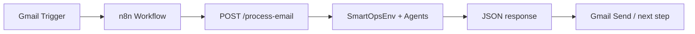

# SmartOps OpenEnv

Production-style **OpenEnv** customer-support environment: triage → response → escalation → manager, with **deterministic agents** (no LLM API required), **graded rewards**, and a **stable FastAPI** contract for real automation.

## Real-world system (n8n + Gmail)

In production, email flows through automation without manual dashboards:



- **Gmail** receives customer mail; **n8n** runs on new message.
- **HTTP Request** node calls this service with `subject`, `body`, `customer_tier`.
- The app runs **`SmartOpsEnv`** with a fixed agent sequence and returns **the same JSON shape as before** so existing workflows keep working.

If you previously started the API with `uvicorn api:app`, the project now uses a package layout. Use:

```bash
python -m uvicorn main:app --host 0.0.0.0 --port 8000
```

On Windows, `uvicorn` is often not on `PATH` even after `pip install`; **`python -m uvicorn`** always uses the same environment as `python`. Equivalent: `python -m uvicorn api.main:app`.

**Browser:** `0.0.0.0` is only for binding the server; it is not a valid URL. Open **`http://127.0.0.1:8000/`** or **`http://localhost:8000/`** on the same machine (health check: `GET /`).

## OpenEnv specification

| Piece | Location |
|--------|-----------|
| Environment | `env/smart_ops_env.py` — `reset`, `step`, `state` |
| Models | `env/models.py` — `Observation`, `Action`, `Reward` |
| Grader | `env/graders.py` — `grade(task, memory, step_count) -> Reward` |
| Tasks | `tasks/definitions.py` — email input, expected outputs, evaluation rules |
| Agents | `agents/` — `triage_agent`, `response_agent`, `escalation_agent` |
| Gym wrapper | `env/gym_wrapper.py` — RL integration |
| Config | `openenv.yaml` |

### Reward weights

- Category match: **0.4**
- Response keyword match: **0.3**
- Escalation correctness: **0.2**
- Priority correctness: **0.1**
- Inefficiency penalty: up to **0.2** (steps beyond four)

Final score is clamped to **[0, 1]**.

### API (unchanged contract)

**`POST /process-email`**

Request:

```json
{
  "subject": "...",
  "body": "...",
  "customer_tier": "user"
}
```

Response:

```json
{
  "category": "...",
  "urgency": 1,
  "response": "...",
  "escalated": false,
  "priority": 2,
  "score": 0.95
}
```

- **`score`** is the graded reward after the manager step (against a **deterministic task** inferred from email content for benchmarking).

## Project layout

```
env/           # SmartOpsEnv, models, graders, gym wrapper
agents/        # triage, response, escalation
api/           # FastAPI application
tasks/         # Task registry + deterministic task resolution
scripts/       # baseline, training, eval
main.py        # Uvicorn entry: `app`
app.py         # Streamlit dashboard (optional)
```

## Local setup

```bash
pip install -r requirements.txt
```

### Run FastAPI (n8n target)

```bash
python -m uvicorn main:app --reload --port 8000
```

### Run Streamlit UI

```bash
streamlit run app.py
```

### Baseline (all tasks, fixed policy)

```bash
python scripts/run_baseline.py
```

### RL training (optional)

```bash
pip install -r requirements-rl.txt
python scripts/train_rl.py
python scripts/eval_rl.py
```

## Docker

```bash
docker build -t smartops-openenv .
docker run -p 8000:8000 smartops-openenv
```

## Hugging Face Spaces

- Use this repo with **Docker** or a **custom start command**: `python -m uvicorn main:app --host 0.0.0.0 --port 7860` (Spaces often maps **7860**; adjust the Space settings if needed).
- **`requirements.txt`** is CPU-friendly (no PyTorch unless you add RL extras).

## Tasks

| Task | Difficulty | Role |
|------|------------|------|
| `refund_request` | easy | Billing / refund wording |
| `login_issue` | medium | Access / login issues |
| `system_outage` | hard | Outage / urgent production impact |

Each task includes `email_input`, `expected_outputs`, and `evaluation_rules` in `tasks/definitions.py`.

## License

MIT (adjust as needed).
